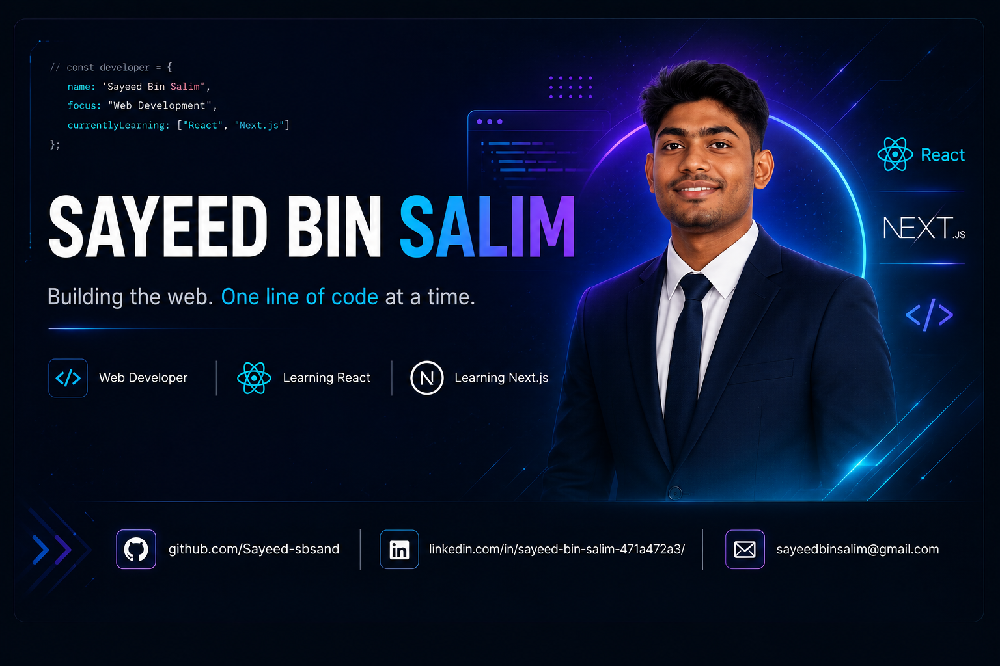

<!-- ===================== PROFILE BANNER ===================== -->

<p align="center">
  
</p>

<!-- ===================== INTRODUCTION ===================== -->

<p align="center">
  
</p>

<h1 align="center">
  Hi there! 👋
</h1>

<h3 align="center">
  I'm Sayeed Bin Salim
</h3>
<p align="center">
  Web Development Learner • CSE Student • Future Full-Stack Developer
</p>


<!-- ===================== SOCIAL LINKS ===================== -->

<p align="center">

  <a href="https://github.com/Sayeed-sbs">
    
  </a>

  <a href="https://www.linkedin.com/in/sayeed-bin-salim-471a472a3/">
    
  </a>

  <a href="mailto:sayeedbinsalim@gmail.com">
    
  </a>

</p>

<!-- ===================== ABOUT ME ===================== -->

## 🚀 About Me

<p align="center">
  <i>
    I'm passionate about building modern and interactive web experiences
    and continuously improving my development skills.
  </i>
</p>

<br>

```javascript
const sayeed = {
    name: "Sayeed Bin Salim",
    role: "Web Development Learner",

    currentlyLearning: [
        "React",
        "Next.js"
    ],

    interests: [
        "Frontend Development",
        "Modern UI",
        "Web Applications"
    ],

    goal: "Become a skilled Full-Stack Developer",

    philosophy: "Learn • Build • Improve • Repeat 🚀"
};
```

<p align="center">
  💻 Learning by building • 🧠 Solving problems • 🚀 Improving every day
</p>

<!-- ===================== TECHNOLOGIES ===================== -->

## 🛠️ Technologies

<p align="center">
  
</p>

<!-- ===================== DEVELOPMENT TOOLS ===================== -->

## 🔧 Development Tools

<p align="center">
  
</p>

<!-- ===================== CURRENT FOCUS ===================== -->

## 🎯 Currently Learning

<p align="center">
  
</p>

<p align="center">
  <strong>React ⚛️ &nbsp; • &nbsp; Next.js ▲</strong>
</p>

<br>

<table align="center">
  <tr>
    <td align="center" width="250">
      <h3>⚛️ React</h3>
      <p>
        Learning component-based UI development,
        props, state, hooks, and modern React patterns.
      </p>
    </td>

    <td align="center" width="250">
      <h3>▲ Next.js</h3>
      <p>
        Learning how Next.js extends React
        for building modern web applications.
      </p>
    </td>
  </tr>
</table>

<br>

<p align="center">
  🚀 <i>Learning → Building → Improving</i>
</p>

<!-- ===================== FEATURED PROJECTS ===================== -->

## 🚀 Featured Projects

<p align="center">
  <i>
    Some of the projects I've built while learning and exploring web development.
  </i>
</p>

<br>

<table align="center">
  <tr>
    <td width="50%" align="center">

### 🛒 OmniHub E-commerce

A modern e-commerce project focused on building a complete web experience.

<a href="https://github.com/Sayeed-sbs/Omnihub_E-commerce-">
  
</a>

</td>

<td width="50%" align="center">

### 🏢 Saitrox Industry Website

A corporate-style website designed to present an industry/business professionally.

<a href="https://github.com/Sayeed-sbs/Saitrox_Industry_Website">
  
</a>

</td>
  </tr>

  <tr>
    <td width="50%" align="center">

### 🎤 DevConf 2026

A conference website project focused on modern web design and responsive layouts.

<a href="https://github.com/Sayeed-sbs/devconf-2026">
  
</a>

</td>

<td width="50%" align="center">

### 📋 Personal Productivity Management

A Java OOP project for managing users, tasks, goals and productivity.

<a href="https://github.com/Sayeed-sbs/personal-productivity-management-system">
  
</a>

</td>
  </tr>
</table>

<br>

<p align="center">
  🚀 <strong>More projects coming soon...</strong>
</p>

<!-- ===================== GITHUB STATISTICS ===================== -->

## 📊 GitHub Statistics

<p align="center">

  

  

</p>

<!-- ===================== GITHUB STREAK ===================== -->

## 🔥 GitHub Streak

<p align="center">

  

</p>

<!-- ===================== CODING ACTIVITY ===================== -->

## 📈 Coding Activity

<p align="center">

  

</p>

<!-- ===================== GOALS & ROADMAP ===================== -->

## 🎯 Goals & Learning Roadmap

<p align="center">
  <i>
    Continuously learning, building, and improving.
  </i>
</p>

<br>

<table align="center">
  <tr>
    <td align="center" width="250">
      <h3>⚛️ React</h3>
      <p>Deepen my understanding of modern React and component-based development.</p>
    </td>

    <td align="center" width="250">
      <h3>▲ Next.js</h3>
      <p>Learn full-stack development with Next.js and build production-ready applications.</p>
    </td>

    <td align="center" width="250">
      <h3>🚀 Full-Stack</h3>
      <p>Expand my skills toward backend development and complete web applications.</p>
    </td>
  </tr>
</table>

<br>

<p align="center">
  <strong>Learn → Build → Experiment → Improve → Repeat 🔥</strong>
</p>

<!-- ===================== CONNECT ===================== -->

## 🤝 Let's Connect

<p align="center">
  <i>
    I'm always interested in learning, building projects,
    and connecting with other developers.
  </i>
</p>

<br>

<p align="center">

  <a href="https://github.com/Sayeed-sbs">
    
  </a>

  <a href="https://www.linkedin.com/in/sayeed-bin-salim-471a472a3/">
    
  </a>

</p>

<br>

<p align="center">
  
</p>

<br>

<p align="center">
  <strong>Thanks for visiting my profile! 👋</strong>
</p>

<p align="center">
  <i>Keep learning. Keep building. Keep growing. 🚀</i>
</p>

<!-- ===================== END ===================== -->


